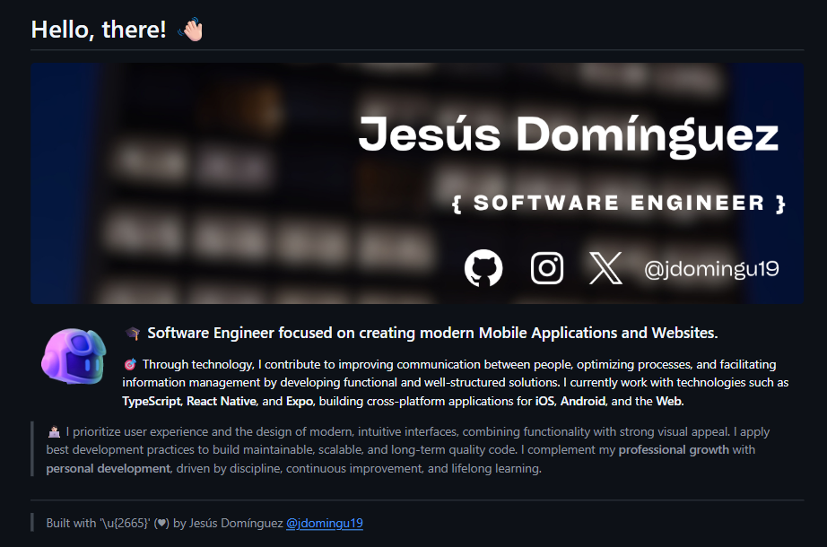
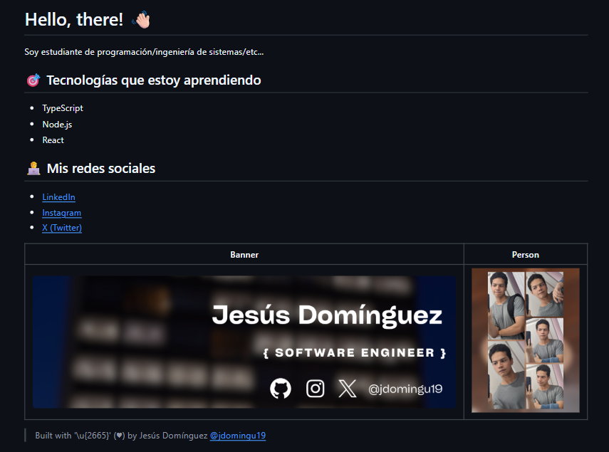
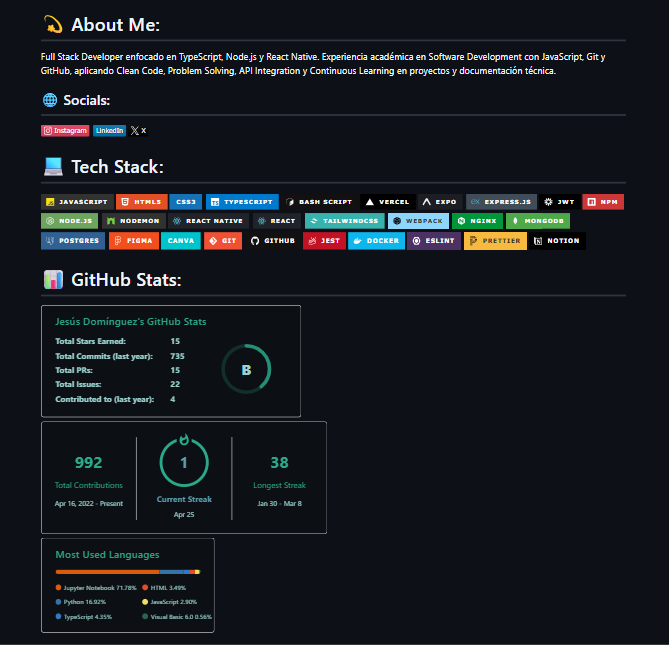
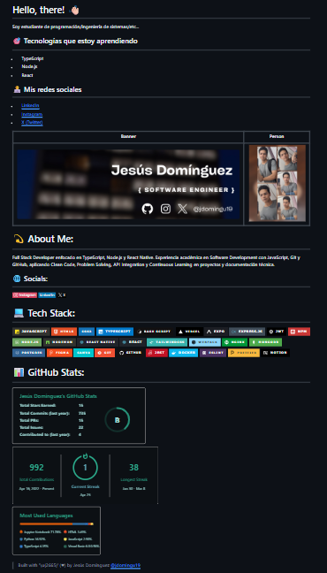

# IEEE Git & GitHub

Amet et consectetur ea id excepteur. Magna elit occaecat ea ullamco pariatur occaecat aliqua dolor non cupidatat laborum. Culpa cupidatat in cupidatat nisi laborum tempor et cillum. Eiusmod quis ullamco tempor occaecat non consequat. Sunt est eu sunt ullamco consectetur commodo. Excepteur exercitation deserunt aliqua et minim dolore aliqua incididunt.

## 00-README.md

> Este script Markdown muestra la versión de profile al comenzar la charla. Los elementos actuales eran mi primer banner profesional con mi username de redes sociales principales; tres párrafos descriptivos en inglés sobre mi profesión, mis tecnologías, y mis objetivos; y una firma profesional de mi marca personal.

## 01-README.md

> En este primer Markdown hecho en la conferencia; se enseñó los principios básicos para un profile readme; el uso de títulos y subtítulos; el uso de listas para ordenar tus skills y tecnologías; el uso de emojis para der personalidad a las secciones; dar enlaces a tus redes sociales profesionales y más usadas; el uso de fotografías sobre ti mismo para mostrar confianza, presencia, y humanidad.

## 02-README.md

> En este tercer ejemplo de Markdown aprendimos a usar generadores de profile README de otros usuarios, y el uso de prompts estratégicos para crear una descripción profesional corta para hojas de vidas y filtros ATS. Aprendimos sobre el uso de badges con los markdown, y la posibilidad de mostrar tus logros de GitHub.

## 03-README.md

> Este último ejemplo, es una combinación de los dos Markdown creados anteriormente; a uso personal, sirve para tener una visión amplia del perfil, y obtener ideas sobre qué mejorar, para poder comunicar correctamente tus habilidades, tus logros, y tus proyectos.

## Shared resources

> Cillum sit elit fugiat consectetur dolore enim voluptate laboris ex anim sint velit sit est. Incididunt sint nostrud non cupidatat sint quis aute quis commodo. Lorem esse qui adipisicing quis incididunt do non voluptate incididunt fugiat fugiat. Consectetur aliquip nulla do reprehenderit esse aliqua sit anim incididunt fugiat. Consectetur exercitation mollit consectetur sit Lorem.

- [Let's Build your GitHub Profile by Kelly Villa](https://kelly-hecate-villa.gitbook.io/github-profile-readme-cuc)
- [GPRM - Best Profile Generator](https://gprm.itsvg.in/)
- [GitBook - Turn documentation into your product’s knowledge system](https://www.gitbook.com/)

##

> Built with '\u{2665}' (♥) by Jesús Domínguez [@jdomingu19](https://github.com/jdomingu19/)
